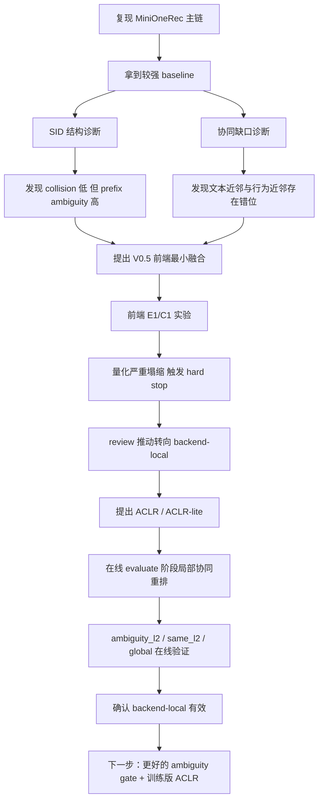

# 研究主线总结：从 MiniOneRec 复现到 ACLR-lite

## 1. 一句话结论

我们已经完成了：

1. `MiniOneRec` 主链复现与稳定化。
2. `SID` 结构诊断与协同缺口诊断。
3. 前端最小协同融合路线 `V0.5-E1/C1` 的证伪。
4. `ACLR-lite` 在线验证，确认 **backend-local / leaf-local refinement** 是当前更值得继续推进的方向。

当前最稳的判断是：

> 当前系统的主要问题不是全局 collision，而是 **local leaf ambiguity**；  
> 当前更值得继续押注的不是前端 collaborative tokenizer，而是 **ACLR / backend-local refinement**。

---

## 2. 全局逻辑图



---

## 3. 起点：为什么要做这件事

最开始的目标不是直接“发明一个新方法”，而是先回答两个问题：

1. `MiniOneRec` 主链到底能不能稳定复现？
2. 如果已经接近论文指标但仍然有 gap，真正的瓶颈到底是什么？

我们早期考虑过的可能原因包括：

- 公开代码和论文 recipe 不一致
- backbone 容量差异
- `SID / tokenizer` 有结构性问题
- `RL` 配方有问题

相关基础文档与台账：

- [project_understanding_report.md](/home/leejt/OneRec/idea-discovery/2026-04-07-sid-collab/10_project_reports/01_project_understanding_report.md)
- [mini_onerec_reproduction_progress.md](/home/leejt/OneRec/idea-discovery/2026-04-07-sid-collab/10_project_reports/02_reproduction_progress.md)
- [experiment_results.csv](/home/leejt/OneRec/experiment_results.csv)
- [legacy_experiment_results.csv](/home/leejt/OneRec/legacy_experiment_results.csv)

---

## 4. 复现阶段：我们已经做成了什么

### 4.1 主链已经稳定跑通

我们已经稳定跑通：

```text
SID -> SFT -> RL -> Evaluate
```

而且解决了几个关键工程问题：

- `evaluate.sh` 脏结果复用问题
- 训练失败后仍继续评测的问题
- RL effective batch 配方问题

### 4.2 当前最好结果

#### Industrial 当前最好

- 实验：`title_history2sid_off__desc_align_p05 + RL(batch256)`
- 结果文件：
  [final_result_rl_Industrial_and_Scientific_title_history2sid_off__desc_align_p05_batch256_20260329_152417.json](/home/leejt/OneRec/results/final_result_rl_Industrial_and_Scientific_title_history2sid_off__desc_align_p05_batch256_20260329_152417.json)

关键指标：

| 指标 | 数值 |
|---|---:|
| HR@3 | 0.10038 |
| HR@5 | 0.11979 |
| HR@10 | 0.15133 |
| NDCG@3 | 0.08903 |
| NDCG@5 | 0.09704 |
| NDCG@10 | 0.10726 |

#### Office 当前最好

- 实验：`legacy_rl_office_refactor_16`
- 记录在：
  [legacy_experiment_results.csv](/home/leejt/OneRec/legacy_experiment_results.csv)

关键指标：

| 指标 | 数值 |
|---|---:|
| HR@3 | 0.11899 |
| HR@5 | 0.13214 |
| HR@10 | 0.15166 |
| NDCG@3 | 0.10546 |
| NDCG@5 | 0.11087 |
| NDCG@10 | 0.11714 |

### 4.3 复现阶段额外得到的重要结论

- `repo-faithful` 主线更接近公开 `sft.py / rl.py / evaluate.py`
- `TitleHistory2Sid` 不是当前最优增强方向
- `description alignment` 更有效
- RL 的 effective batch 很重要：
  - `batch256` 明显优于 `batch512`

---

## 5. 第一步诊断：SID 结构到底哪里有问题

脚本：

- [sid_diagnostics.py](/home/leejt/OneRec/scripts/sid_diagnostics.py)

结果台账：

- [sid_diagnostic_results.csv](/home/leejt/OneRec/sid_diagnostic_results.csv)

### 5.1 关键发现

#### (1) collision 很低，不是主矛盾

- Industrial：约 `0.43%`
- Office：约 `0.43%`

这说明：

- “很多 item 完全撞到同一个 SID”不是主故事
- collision 可以记录，但不足以解释当前主要 gap

#### (2) prefix ambiguity 很明显

真实现象是：

- same-prefix 错误存在
- same-l2 错误存在
- 模型经常已经走到差不多正确的子树，但最后 leaf 选错

可以把 `SID` 想成三层树：

- 第 1 层 `a`：大楼层
- 第 2 层 `b`：房间
- 第 3 层 `c`：盒子

当前主要问题更像：

- 楼层大致对
- 房间也常常差不多对
- 但最后拿错了盒子

### 5.2 这一阶段的核心判断

> 当前 MiniOneRec 的主要问题不是 global tokenizer 崩坏，  
> 而是 **local leaf ambiguity**。

---

## 6. 第二步诊断：为什么说 text-driven SID 不够

脚本：

- [collaborative_gap_diagnostics.py](/home/leejt/OneRec/scripts/collaborative_gap_diagnostics.py)

这不是因果证明器，而是一个**相关性诊断工具**。

### 6.1 用到的协同分数

先从 train 序列里统计一个浅层条件概率：

\[
P(j \mid h) \approx \frac{\text{pair\_count}(h,j)}{\text{hist\_count}(h)}
\]

其中：

- `h` 是历史 item
- `j` 是候选 item

然后对整个 history 定义协同兼容分：

\[
CF(j \mid h_{1:T}) = \sum_{r=1}^{K} \frac{P(j \mid h_{T-r+1})}{r}
\]

解释：

- 最近历史 item 权重大
- 越早的历史 item 权重越小

### 6.2 实际看到了什么

我们观察到：

- 全局错误里，协同缺口不是全部错误的唯一来源
- 但在 `same-l1 / same-l2` 的局部混淆里，这个问题非常明显

也就是：

- 预测错的 item 往往和 target 文本很像
- 但从 train-only 行为协同看，target 常常更合理

### 6.3 这一阶段的核心判断

> 当前 SID 更擅长组织“文本近邻”，  
> 不够擅长把“行为上应该区分开的局部近邻”拉开。

---

## 7. 第一版解决办法：V0.5 前端最小融合

相关文档：

- [v0_5_experiment_plan.md](/home/leejt/OneRec/idea-discovery/2026-04-07-sid-collab/20_current_working_idea/05_v0_5_experiment_plan.md)

### 7.1 当时的目标

并不是直接宣称做新 tokenizer，而是做一次最小证伪：

> 如果把最小协同向量注入 SID 输入 embedding，  
> 前端路线到底值不值得继续？

### 7.2 对应实验

- `E1`: `text + collaborative vector`
- `C1`: `text + shuffled-collab`

实现脚本：

- [build_sid_fused_embedding.py](/home/leejt/OneRec/scripts/build_sid_fused_embedding.py)

### 7.3 当时的做法

1. 从 `train.csv` 构 item-item 转移矩阵
2. 做 `TruncatedSVD(32)` 得到 `64d` 协同向量
3. 与 `Qwen text embedding` 拼接
4. 再送进现有 SID 训练链

---

## 8. V0.5 前端路线为什么停了

### 8.1 文献层面的风险

我们后来确认：

- “全局 collaborative tokenizer / SID 重构”赛道已经很拥挤
- `ReSID / PRISM / HiD-VAE / PIT / FusID` 等工作已经把大框架占得很满

所以即使前端路线有效，也很难直接把它写成“又一个 collaborative tokenizer”故事。

### 8.2 实验层面的 hard stop

更关键的是，真实实验结果直接触发了停止条件：

| 设置 | 最终 SID collision rate |
|---|---:|
| baseline | 0.00434 |
| `E1` (`text + cf`) | 0.74037 |
| `C1` (`text + shuffled-cf`) | 0.62832 |

这说明：

- `E1` 比 baseline 高约 `170x`
- `C1` 比 baseline 高约 `145x`
- `E1` 甚至比 `C1` 更差

所以问题不是“协同信息不够好”，而是：

> 当前这种前端最小拼接式协同注入，在现有 MiniOneRec RQ-VAE 上会导致严重量化塌缩。

### 8.3 结论

前端 `V0.5-E1/C1` 直接 hard stop：

- 不继续扩
- 不继续推到 `convert -> SFT -> evaluate`
- 不再把前端 collaborative tokenizer 作为当前最优主线

---

## 9. Review 如何把主线推向 ACLR

### 9.1 导师反馈

导师的核心建议是：

- 不要一下做太多
- 不要堆太多 loss
- 先聚焦一个真正清楚的问题

### 9.2 V0.5 review

后续 review 又进一步强调：

- `V0.5` 只能是一个带 hard stop 的最小证伪包
- 必须尽早把 **backend-local** 作为直接对照

这一步把我们从：

- “继续想怎么改 tokenizer”

推到了：

- “是不是应该直接修 local leaf ambiguity”

---

## 10. 新主线：ACLR

主文档：

- [IDEA_REPORT.md](/home/leejt/OneRec/idea-discovery/2026-04-07-sid-collab/20_current_working_idea/03_current_idea_report.md)
- [refine-logs/FINAL_PROPOSAL.md](/home/leejt/OneRec/idea-discovery/2026-04-07-sid-collab/20_current_working_idea/06_refine_logs_current/FINAL_PROPOSAL.md)

新的核心方法不是再重建整个 SID，而是：

**ACLR: Ambiguity-Aware Collaborative Leaf Refinement**

它的核心想法是：

- 不改全局 tokenizer
- 不重建整棵 SID 树
- 只在高歧义 `(a,b)` 前缀里，对第三层 leaf 做局部协同修正

一句话概括：

> 不是“重新造树”，而是“承认树的大体结构已经够用，只修最容易拿错的叶子”。

---

## 11. ACLR-lite：先做最小在线验证

在真正做训练版 ACLR 之前，我们先实现了一个在线版最小验证。

实现代码：

- [collaborative_rerank.py](/home/leejt/OneRec/src/onerec/evaluate/collaborative_rerank.py)
- [pipeline.py](/home/leejt/OneRec/src/onerec/evaluate/pipeline.py)

相关配置：

- [evaluate_industrial_aclr_lite.yaml](/home/leejt/OneRec/config/evaluate_industrial_aclr_lite.yaml)
- [evaluate_industrial_aclr_lite_same_l2.yaml](/home/leejt/OneRec/config/evaluate_industrial_aclr_lite_same_l2.yaml)
- [evaluate_industrial_aclr_lite_global.yaml](/home/leejt/OneRec/config/evaluate_industrial_aclr_lite_global.yaml)

### 11.1 ACLR-lite 具体做了什么

1. baseline 正常生成 beam
2. 根据当前 top1 的 prefix 确定局部候选集合
3. 用 train-only 协同分对这部分候选重排
4. 再按重排后的顺序计算指标

这一步的意义是：

- 不改训练
- 不改 SID
- 先验证 backend-local / leaf-local 修正到底是不是真有效

---

## 12. ACLR-lite 在线实验结果

我们最终补齐了三种在线模式：

- `ambiguity_l2`
- `same_l2`
- `global`

### 12.1 与 baseline 的真实对比

| 设置 | 激活样本数 | NDCG@3 | NDCG@5 | NDCG@10 | HR@1 | HR@3 | HR@5 | HR@10 |
|---|---:|---:|---:|---:|---:|---:|---:|---:|
| baseline RL | 0 | 0.08903 | 0.09704 | 0.10726 | 0.07324 | 0.10038 | 0.11979 | 0.15133 |
| `ambiguity_l2` | 1242 | 0.09459 | 0.10145 | 0.11091 | 0.07920 | 0.10589 | 0.12266 | 0.15222 |
| `same_l2` | 2605 | 0.09655 | 0.10293 | 0.11218 | 0.08162 | 0.10743 | 0.12310 | 0.15200 |
| `global` | 4533 | 0.09945 | 0.10573 | 0.11391 | 0.08383 | 0.11074 | 0.12597 | 0.15133 |

### 12.2 这组结果说明了什么

- `global` 最强，但太粗，不适合直接当最终方法
- `same_l2` 是当前最强 local 修正版本
- `ambiguity_l2` 方向是对的，但当前 gate 还偏保守

更重要的是：

- 在线结果和离线 proxy 对齐
- `constraint_invalid_total = 0`
- backend-local 收益不是假象，而是在真实 evaluate 里成立

---

## 13. 真实例子：ACLR-lite 到底在修什么

一个典型修正成功样本：

- 历史里连续出现多个 PLA filament
- target：`Inland Peak Green PLA`
- baseline top1：`Inland Blue PLA`
- ACLR-lite top1：`Inland Peak Green PLA`

重要的是：

- baseline 和 target 的前两层 SID 前缀完全一样
- ACLR-lite 没有换子树
- 只是把同一个 `(a,b)` 房间里的错误 leaf 换成了正确 leaf

这非常符合我们的诊断结论：

> 当前剩余错误很多真的是 leaf-level local ambiguity，  
> 而不是全局生成空间完全跑偏。

---

## 14. 到目前为止，我们实际上完成了什么

如果压成一条完整逻辑链，就是：

### Motivation

- 已经接近论文结果，但仍然有 gap
- 需要找出真正瓶颈

### 诊断

- collision 低，不是主矛盾
- prefix ambiguity 高
- text-driven SID 更偏文本近邻，而不是行为可分邻域

### 第一版尝试

- 前端最小融合 `E1/C1`

### 暴露问题

- 文献赛道拥挤
- 实验上直接量化塌缩

### Review 推动转向

- 把 `V0.5` 明确成证伪包
- 引入 backend-local 对照

### 新主线

- ACLR / local leaf refinement

### 在线验证

- ACLR-lite 在线真实有效
- backend-local / leaf-local 修正值得继续推进

---

## 15. 当前最稳的结论

到现在为止，最稳的判断已经非常清楚：

1. **前端最小融合路线先停**
   - 当前这版简单前端协同注入不稳定

2. **backend-local / ACLR 是当前更值得继续推进的主线**
   - 因为它已经在真实在线评测里兑现了稳定收益

3. **当前问题的核心不是 global tokenizer 崩了，而是 local leaf ambiguity**
   - 这是我们最重要的机制性判断

---

## 16. 下一步建议

基于目前所有工作，下一步最自然的是：

1. 以 `same_l2` 作为强 local baseline
2. 设计一个比当前 `leaf-count threshold` 更好的 `ambiguity gate`
3. 做训练版 ACLR：
   - `training-only`
   - `inference-only`
   - `training + inference`

这样我们才会从：

- “一个有效的在线后处理验证”

进一步推进到：

- “真正改造 MiniOneRec 链路的正式方法”

---

## 17. 最后一段总结

如果只用一句话概括我们现在的研究状态：

> 我们已经通过复现、诊断、证伪和在线验证，基本完成了方向筛选；  
> 当前最值得继续押注的，不是前端 collaborative tokenizer，  
> 而是围绕 **local leaf ambiguity** 的 **ACLR / backend-local refinement** 主线。
