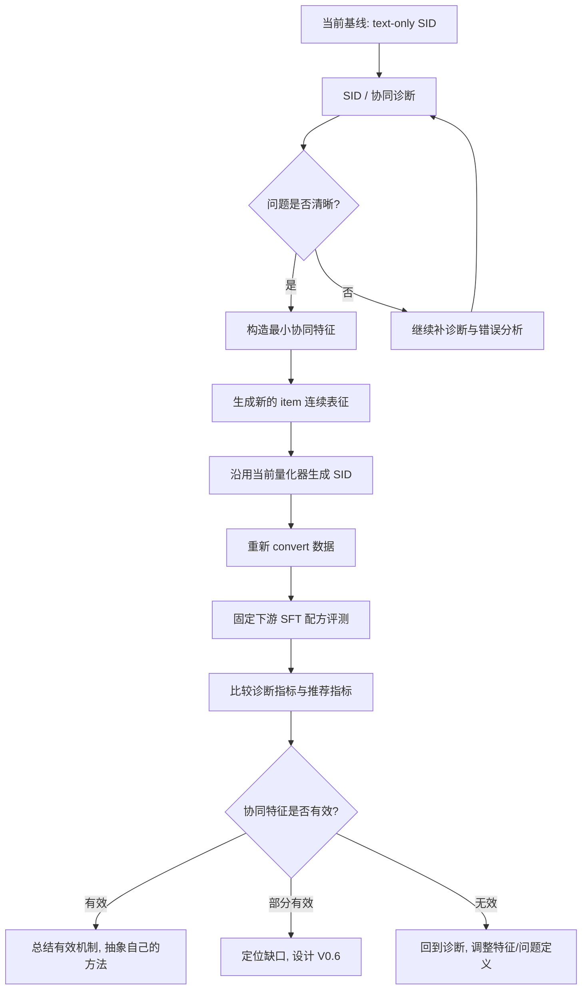

# V0.5 实验方案

## 定位

当前阶段记为 **V0.5**，而不是正式方法版本。

原因是：

- 我们已经完成了对 MiniOneRec 主线的复现、代码梳理和多轮对照实验。
- 我们已经有了一批支持性证据，说明当前 `SID / tokenizer` 确实存在值得研究的问题。
- 但我们还没有进入“正式方法设计 + 稳定 ablation + 论文级叙事闭环”的阶段。
- 当前更像是一个**研究摸索期**：通过诊断和小规模结构改动，确认真正的问题在哪里，再逐步发展出属于我们自己的方法。

因此，`V0.5` 的目标不是“提出最终模型”，而是：

- 把当前方向压缩成一个**单轮证伪包**；
- 用最小代价验证前端协同增强是否真的还有 headroom；
- 与 backend-local 修正基线正面对照；
- 给后续主线选择提供明确 stop / go 信号。

---

## 当前已经得到的关键信号

### 1. 复现已经基本站住

- 目前使用 `Qwen3-1.7B`，已经在两个数据集上超过了大多数 baseline。
- Office 上已经非常接近论文中的最终结果。
- Industrial 上也已经缩小到了一个较小但仍存在的 gap。

这说明当前工作已经不是“有没有跑通”，而是“怎样解释剩余 gap，并提出真正有价值的新方法”。

### 2. SID 的主要问题不是 collision 本身

我们已经做过 SID 结构诊断，结论是：

- collision rate 只有约 `0.43%`
- collision 确实存在，但不是当前最主要的问题
- 更强的问题是：
  - prefix ambiguity
  - code 在不同前缀下的上下文歧义
  - same-prefix / same-subtree 内部的细粒度区分困难

### 3. 协同信号缺口确实存在，但当前证据是“相关性诊断”，不是“因果证明”

我们已经通过 train-only 的协同兼容分数分析发现：

- 模型的一部分错误，确实表现为：
  - 文本上非常相似
  - 但真实 target 在协同上更合理
- 这种现象在 same-prefix 的局部混淆中更明显

这说明：

- 当前 tokenizer / SID 更擅长组织文本语义近邻
- 对行为上应当区分的近邻，缺乏足够敏感性

这为“在 SID 构建阶段引入协同信息”提供了较强动机。

---

## V0.5 的核心研究问题

V0.5 只聚焦一个更窄的问题：

> 在 leakage-safe 条件下，把**最小协同行为信号**注入 SID 输入，是否能减少局部 prefix ambiguity，并带来稳定的任务收益？

对应的工作假设是：

> 如果在 SID 构建阶段引入**单一、轻量、可控、无时间泄露**的协同特征，那么：
> 1. same-prefix 内部的局部混淆会减少；
> 2. 相关 SID 诊断指标会改善；
> 3. 固定下游 SFT 时，推荐指标会出现稳定正增益。

---

## 当前最核心的问题

现在真正要回答的问题不是：

> 我们要不要立刻确定最终论文主线？

而是：

> 当前把最小协同信号注入 SID 输入之后，效果是否**优于一个近零成本的 backend-local 修正基线**？

只有先把这个问题回答清楚，后面才能决定：

- 前端 SID 路线是否值得继续投入
- 还是应该尽快转向 ACLR / backend-local 修正路线

---

## 为什么现在不直接切 ACLR，但也不能把它放成可选项

ACLR 的优点很明显：

- 问题更窄
- 创新更集中
- 不和全局 tokenizer 重构强烈撞车

但现在还不适合立刻把 ACLR 当唯一主线，原因有两个：

### 原因 1：我们还不知道前端协同增强有没有足够 headroom

如果前端协同增强本身就能明显改善：

- SID 诊断指标
- 下游固定 SFT 指标

那么这说明：

- SID 输入层面的协同缺失是真问题
- 这一层仍值得进一步研究

### 原因 2：ACLR 更像第二阶段方法

ACLR 解决的是：

- 在现有 tokenizer 已经把样本带进大致正确子树后
- 如何修复第三层 leaf 级局部歧义

所以 ACLR 更适合在下面这个判断之后介入：

- “前端 SID 已经增强过，但 same-prefix 局部叶子混淆仍然明显”

因此当前更合理的关系是：

- `V0.5` 先做一次严格、最小的前端证伪实验
- `ACLR-lite` 必须作为**直接对照基线**同时出现
- 只有当前端实验明确胜出时，才允许继续扩展前端路线

---

## 为什么不直接照搬 FAMAE

ReSID 中的 FAMAE 可以作为启发，但不能直接照搬。

原因有三点：

1. 它本身已经是现成模块，直接套用创新性不足。
2. 它包含的设计较多，如果一上来全部加入，很难解释到底是哪一部分真正起作用。
3. 我们当前已经有明确诊断线索，应该围绕自己的问题来拆解设计，而不是先堆模块再找故事。

所以 V0.5 的策略是：

- 参考 FAMAE 的“多域输入”思想
- 但只保留最小、最必要的部分
- 通过实验逐步发现真正有用的机制
- 最终再抽象成属于我们自己的方法

一句话说：

> 我们不是直接“上 FAMAE”，而是从“文本驱动 SID 缺少协同感知”这个主问题出发，逐步构建自己的字段融合与量化方案。

---

## 为什么现在不重跑纯文本 embedding

当前仓库已经有可用的文本嵌入 baseline：

- `Industrial_and_Scientific.emb-qwen-td.npy`
- `Office_Products.emb-qwen-td.npy`

如果现在重新跑一遍纯文本 embedding，会带来两个问题：

1. 变量不干净
   - 文本嵌入本身变了
   - 协同融合也变了
   - 很难判断提升来自哪一部分

2. 不利于做最小对照
   - 当前最自然的 baseline 就是现有 `text-only SID`

所以现在最合理的做法是：

- 直接复用现有 `text-only embedding`
- 在它基础上加协同特征
- 与原始 baseline 做最小对照

---

## V0.5 的总体流程图

---

## V0.5 的实验逻辑

V0.5 不追求一下子做成完整方法，而是按“问题诊断 -> 最小证伪 -> 固定评测 -> 及时止损/转向”推进。

### Step 1. 固定基线

先固定当前最重要的两类基线：

- `SID 诊断基线`
  - 当前 text-only SID
- `下游评测基线`
  - 固定使用当前较强且稳定的 SFT 配方

这样做的目的是：

- 把 tokenizer 改动和 SFT / RL recipe 改动解耦
- 后面只看“SID 变了以后，下游是否跟着变好”

### Step 2. 构造最小协同特征

这是 V0.5 的真正起点。

这里不直接上复杂神经网络，而是只加入**一个训练交互中可直接提取的轻量协同向量**。

### Step 3. 不改量化器主结构，先改输入

V0.5 先不改 RQ-VAE 主体，不急着上复杂对齐损失。

先做：

- `text-only embedding`
  变成
- `text + lightweight collaborative features`

这样能更干净地回答：

> 仅仅给量化器输入更推荐原生的表征，是否已经足以改善 SID？

### Step 4. 用固定下游检验

新 SID 生成后：

- 重新 `convert`
- 重新跑固定 SFT
- 再做 SID 诊断和推荐评测

只要看到：

- 诊断指标改善
- 推荐指标也改善

就说明这条主线是有效的。

### Step 5. 用对照与 stop rule 做决策

V0.5 这一轮不扩展为路线图，只做一个明确判断：

- 前端最小协同增强是否明显优于 backend-local 修正基线与 falsification control

如果不是，就停止扩张前端路线并转向 ACLR。

---

## V0.5 计划加入的新特征

### 总原则

V0.5 只加入：

- train-only
- 可解释
- 低复杂度
- 不容易引入时间泄露

的协同相关特征。

### 当前建议先做的特征

#### 1. 文本语义特征

这是当前已有的：

- `title`
- `description`

对应现有 `emb-qwen-td.npy` 的主来源。

#### 2. 轻量协同特征

先从最简单、最稳定、最容易隔离变量的开始。

当前第一轮只保留：

- `co-occurrence / transition statistics`
- `协同压缩向量`
  - 例如基于 item-item 转移矩阵做一个低维表示

这类特征的特点是：

- 不需要先上复杂神经模型
- 可解释性强
- 适合作为 V0.5 的最小版本

#### 3. popularity 与 metadata 的位置

`popularity` 与 `brand/category` 目前都**不进入第一轮主实验**：

- `popularity` 更适合做 falsification control
- `brand/category` 更适合放到后续 confirmatory 扩展

---

## V0.5 不建议现在加入的东西

为了避免“堆工作量”，以下内容暂时不建议纳入 V0.5 主实验：

- 完整 FAMAE
- 太多损失项
- RL 奖励改造
- anti-collision 多重正则
- 大量图网络组件

原因很简单：

- 当前还没有证明这些复杂设计一定是必要的
- 现在最重要的是先用小实验把主问题钉住

---

## V0.5 的实验分组建议

### B0: 当前基线

- 输入：`text-only`
- SID：当前生成方式
- 下游：固定 SFT 配方

作用：

- 作为所有后续改动的参照

### R1: backend-local headroom 测量

- 复用现有结果
- 做：
  - global rerank
  - same-`l1` local rerank
  - same-`l2` local rerank

作用：

- 测当前数据上“不改 tokenizer 时，本地协同修正有多少 headroom”
- 为后续 ACLR-lite 基线提供上界感

### R2: backend-local baseline

- 构建一个近零成本的 `ACLR-lite`
- 先做 inference-only 的 ambiguity-aware local leaf bias

作用：

- 建立最小 backend-local 比较对象
- 避免 reviewer 质疑“为什么不先修 leaf”

### E1: text + 单一压缩协同向量

- 在文本 embedding 基础上拼接或融合**单一压缩协同向量**
- 量化器保持不变

作用：

- 验证“只改连续表征输入”是否已经有效

当前建议的具体落地形式是：

- baseline：`Industrial_and_Scientific.emb-qwen-td.npy`
- 新实验：`Industrial_and_Scientific.emb-qwen-tdcf-v05-e1.npy`

其中：

- `td` = title + description
- `cf` = collaborative features
- `v05-e1` = V0.5 第一版最小实验

限制条件：

- 只做 `Industrial`
- 固定 SFT 配方
- 先跑 `2 seeds`
- 不加 popularity
- 不加 metadata
- 不改量化器结构

### C1: falsification control

- 二选一：
  - `popularity-only`
  - `shuffled-collab`

当前更推荐：

- `shuffled-collab`

作用：

- 排除“只是任何额外向量都能涨”
- 排除“只是在偷加热度先验”的解释

### 后续候选（不进入第一轮）

- `E2`: `text + collaborative + metadata`
- `E3`: 诊断驱动的小结构改动

这些都只有在 `E1` 清楚为正且优于 `R2/C1` 时才考虑进入下一轮。

---

## 每一步主要看什么指标

### A. SID 诊断指标

优先看：

- `collision_rate`
- `weighted_prefix_conditional_entropy_l2_given_l1_bits`
- `weighted_prefix_conditional_entropy_l3_given_l1l2_bits`
- `same_l1 / same_l2 among top1 errors`
- `collaborative gap bestcase`

其中最重要的是：

- prefix conditional entropy
- same-prefix error
- collaborative gap

因为它们比单纯 collision 更贴近我们当前发现的真实问题。

### B. 下游推荐指标

重点看：

- `HR@3 / HR@5 / HR@10`
- `NDCG@3 / NDCG@5 / NDCG@10`

### C. 错误案例

每轮都应该抽典型案例看：

- 同系列商品的错分是否减少
- same-prefix 的局部混淆是否减少
- “文本很像但协同更合理”的错误是否减少

---

## V0.5 的成功标准

V0.5 不要求一下子超过论文最终结果。

它的成功标准应该更现实：

### 成功标准 1

在不改下游训练 recipe 的前提下，

- SID 诊断指标至少有一部分稳定改善
- 尤其是 `prefix entropy / same-prefix error / collaborative gap`

### 成功标准 2

固定下游 SFT 后，

- 推荐指标出现稳定正增益

### 成功标准 2.5

- `E1` 必须优于 `R2`（backend-local baseline）或至少形成明确互补证据
- `E1` 必须明显优于 `C1`（falsification control）

### 成功标准 3

能从实验中总结出一个更清楚的问题：

- 到底是“协同输入不够”
- 还是“prefix 量化结构不够稳”
- 或者“字段融合方式不对”

如果能回答这个问题，V0.5 就成功了。

---

## Hard Stop 规则

只要出现下面任一情况，就停止扩展 `V0.5`，转向 ACLR / backend-local 主线：

1. `E1` 不明显优于 `R2`
2. `E1` 只比 `C1` 略好
3. 诊断改善了，但 `HR/NDCG` 几乎不动
4. `Industrial` 上两次 seed 结果不稳定

---

## V0.5 与后续版本的关系

V0.5 的使命不是“定稿”，而是给后续版本铺路。

只有在 `E1` 清楚胜出后，才允许进入下一轮：

- `V0.6`
  - 更明确的 prefix consistency 设计
- `V0.7`
  - 更成熟的字段融合或轻量结构约束
- 更后面
  - 再看是否需要引入更复杂的量化机制

也就是说：

> V0.5 的核心价值，在于帮我们把“模糊的 idea”收缩成“经实验验证过的真实研究问题”。

---

## 当前最优先的具体实施链条

V0.5 当前最优先的不是继续扩方法，而是先完成 `R1 + R2 + E1 + C1` 这组最小证伪包。

### Step 1：从 train.csv 提取协同统计

输入：

- `data/Amazon/train/Industrial_and_Scientific_5_2016-10-2018-11.csv`

提取字段：

- `history_item_id`
- `item_id`

构建一个有方向的 item-item 转移矩阵：

- 历史 item -> target item
- 最近的历史 item 权重大
- 较早的历史 item 权重较小

这个矩阵用于近似表达：

- 某个 item 作为历史出现时，会把用户带向哪些 target item

### Step 2：压缩成低维协同向量

对转移矩阵做低秩分解（如 `TruncatedSVD`），得到：

- item 的 history-role 向量
- item 的 target-role 向量

再拼接得到一个较小维度的协同向量。

当前初版目标：

- 得到 `64d` 协同向量

### Step 3：与文本嵌入融合

将三部分融合：

- 现有文本嵌入
- 协同向量

采用最简单的方式：

- 归一化
- 拼接
- 必要时压回固定维度

目标不是做最强融合，而是做最小、最稳定、最容易解释的融合。

### Step 4：保存新的 embedding 文件

输出：

- `data/Amazon/index/Industrial_and_Scientific.emb-qwen-tdcf-v05-e1.npy`

### Step 5：沿用现有 SID 训练链

后续仍然走现有流程：

- `sid-train`
- `sid-generate`
- `convert`
- 固定 `SFT`
- `evaluate`

这样做的好处是：

- 不需要同时改前端和后端
- 变量最干净

### Step 6：加入对照与控制

在 `E1` 之外，同时准备：

- `R2`: ambiguity-aware local leaf bias
- `C1`: `shuffled-collab` 或 `popularity-only`

这样最终判断不再只依赖“baseline vs E1”，而是依赖：

- baseline
- backend-local baseline
- front-end minimal enhancement
- falsification control

---

## 做完第一轮之后怎么决策

### 如果 E1 明显有效

判断标准：

- SID 诊断明显改善
- 固定 SFT 指标也有提升
- 明显优于 `R2`
- 明显优于 `C1`

那说明：

- 前端协同增强确实有价值
- 可以继续探索更精细但仍然克制的 SID 路线

但仍然不要立刻把“text+cf tokenizer”当最终论文结论。

### 如果 E1 只有小幅改善

那说明：

- 前端协同增强方向是对的
- 但可能不是最终最强抓手

这时 ACLR 会变得更值得继续推进，因为：

- 前端做了一步修正后
- 剩余错误很可能更集中在 leaf 级局部歧义

### 如果 E1 几乎无效

那说明：

- 浅层协同特征注入 SID 输入不够强
- 当前论文主线更应转向 ACLR 或别的后端局部修正方法

### 如果 E1 优于 baseline，但不如 R2

那说明：

- 前端协同信号不是没有用
- 但它不是当前最强干预层

这时不应继续把前端 SID 路线当主线，而应切到 ACLR / backend-local 主线

---

## 当前一句话结论

V0.5 不做“大而全”的方法，而是围绕我们已经诊断出来的真实问题，先做一个**最小、可解释、可验证**的协同增强 SID 方案。  
在这个过程中，我们不直接照搬 FAMAE，而是借鉴其“多域输入”的思想，通过实验逐步长出属于我们自己的方法。
