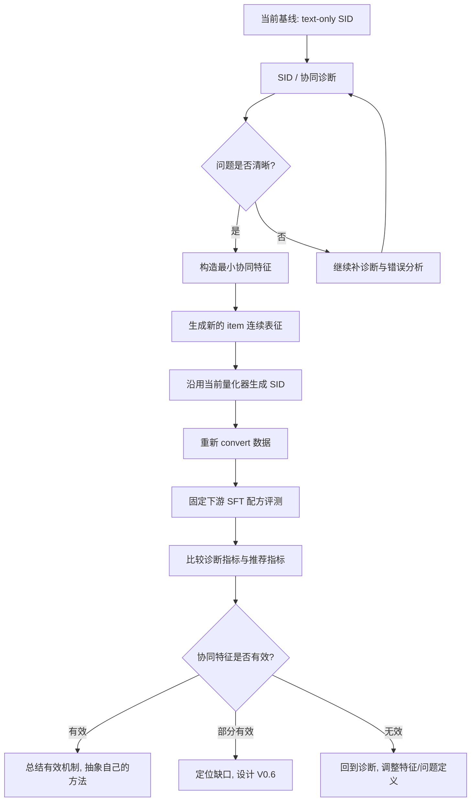

# V0.5 实验方案

## 定位

当前阶段记为 **V0.5**，而不是正式方法版本。

原因是：

- 我们已经完成了对 MiniOneRec 主线的复现、代码梳理和多轮对照实验。
- 我们已经有了一批支持性证据，说明当前 `SID / tokenizer` 确实存在值得研究的问题。
- 但我们还没有进入“正式方法设计 + 稳定 ablation + 论文级叙事闭环”的阶段。
- 当前更像是一个**研究摸索期**：通过诊断和小规模结构改动，确认真正的问题在哪里，再逐步发展出属于我们自己的方法。

因此，`V0.5` 的目标不是“提出最终模型”，而是：

- 固定一条清晰的研究主线；
- 通过最小改动验证主假设；
- 在实验中发现更深层的问题；
- 再据此提出真正属于我们自己的创新方案。

---

## 当前已经得到的关键信号

### 1. 复现已经基本站住

- 目前使用 `Qwen3-1.7B`，已经在两个数据集上超过了大多数 baseline。
- Office 上已经非常接近论文中的最终结果。
- Industrial 上也已经缩小到了一个较小但仍存在的 gap。

这说明当前工作已经不是“有没有跑通”，而是“怎样解释剩余 gap，并提出真正有价值的新方法”。

### 2. SID 的主要问题不是 collision 本身

我们已经做过 SID 结构诊断，结论是：

- collision rate 只有约 `0.43%`
- collision 确实存在，但不是当前最主要的问题
- 更强的问题是：
  - prefix ambiguity
  - code 在不同前缀下的上下文歧义
  - same-prefix / same-subtree 内部的细粒度区分困难

### 3. 协同信号缺口确实存在，但当前证据是“相关性诊断”，不是“因果证明”

我们已经通过 train-only 的协同兼容分数分析发现：

- 模型的一部分错误，确实表现为：
  - 文本上非常相似
  - 但真实 target 在协同上更合理
- 这种现象在 same-prefix 的局部混淆中更明显

这说明：

- 当前 tokenizer / SID 更擅长组织文本语义近邻
- 对行为上应当区分的近邻，缺乏足够敏感性

这为“在 SID 构建阶段引入协同信息”提供了较强动机。

---

## V0.5 的核心研究问题

V0.5 只聚焦一个主问题：

> 现有 MiniOneRec 的 SID 构建主要由文本语义驱动，是否导致了“文本近邻被组织得很好，但行为近邻/行为可分性不足”的问题？

对应的工作假设是：

> 如果在 SID 构建阶段引入**轻量、可控、无时间泄露**的协同特征，那么：
> 1. SID 的前缀结构会更稳定；
> 2. same-prefix 内部的混淆会减少；
> 3. 固定下游 SFT 时，推荐指标会有改善。

---

## 为什么不直接照搬 FAMAE

ReSID 中的 FAMAE 可以作为启发，但不能直接照搬。

原因有三点：

1. 它本身已经是现成模块，直接套用创新性不足。
2. 它包含的设计较多，如果一上来全部加入，很难解释到底是哪一部分真正起作用。
3. 我们当前已经有明确诊断线索，应该围绕自己的问题来拆解设计，而不是先堆模块再找故事。

所以 V0.5 的策略是：

- 参考 FAMAE 的“多域输入”思想
- 但只保留最小、最必要的部分
- 通过实验逐步发现真正有用的机制
- 最终再抽象成属于我们自己的方法

一句话说：

> 我们不是直接“上 FAMAE”，而是从“文本驱动 SID 缺少协同感知”这个主问题出发，逐步构建自己的字段融合与量化方案。

---

## V0.5 的总体流程图

---

## V0.5 的实验逻辑

V0.5 不追求一下子做成完整方法，而是按“问题诊断 -> 最小改动 -> 固定评测 -> 复盘”推进。

### Step 1. 固定基线

先固定当前最重要的两类基线：

- `SID 诊断基线`
  - 当前 text-only SID
- `下游评测基线`
  - 固定使用当前较强且稳定的 SFT 配方

这样做的目的是：

- 把 tokenizer 改动和 SFT / RL recipe 改动解耦
- 后面只看“SID 变了以后，下游是否跟着变好”

### Step 2. 构造最小协同特征

这是 V0.5 的真正起点。

这里不直接上复杂神经网络，而是先加入**训练交互中可直接提取的轻量协同特征**。

### Step 3. 不改量化器主结构，先改输入

V0.5 先不改 RQ-VAE 主体，不急着上复杂对齐损失。

先做：

- `text-only embedding`
  变成
- `text + lightweight collaborative features`

这样能更干净地回答：

> 仅仅给量化器输入更推荐原生的表征，是否已经足以改善 SID？

### Step 4. 用固定下游检验

新 SID 生成后：

- 重新 `convert`
- 重新跑固定 SFT
- 再做 SID 诊断和推荐评测

只要看到：

- 诊断指标改善
- 推荐指标也改善

就说明这条主线是有效的。

### Step 5. 再决定下一步创新方向

如果 V0.5 有效，后面再决定：

- 是继续做 prefix consistency
- 还是做更好的协同字段融合
- 还是做量化阶段的结构约束

也就是说，创新不是先拍脑袋定死，而是在实验过程中逐步长出来。

---

## V0.5 计划加入的新特征

### 总原则

V0.5 只加入：

- train-only
- 可解释
- 低复杂度
- 不容易引入时间泄露

的协同相关特征。

### 当前建议先做的特征

#### 1. 文本语义特征

这是当前已有的：

- `title`
- `description`

对应现有 `emb-qwen-td.npy` 的主来源。

#### 2. 轻量协同特征

先从最简单、最稳定的开始。

建议优先考虑：

- `item popularity`
  - item 在 train 中被交互的次数
- `co-occurrence / transition statistics`
  - item 与其他 item 的共现或转移强度
- `协同压缩向量`
  - 例如基于 item-item 共现矩阵做一个低维表示

这类特征的特点是：

- 不需要先上复杂神经模型
- 可解释性强
- 适合作为 V0.5 的最小版本

#### 3. 轻量结构化字段

当前 metadata 中已有：

- `brand`
- `categories`

这些不是协同信息，但它们和协同/语义边界有关，后续可以作为辅助字段。

不过 V0.5 不建议一开始就全部加进去。

优先顺序建议是：

1. `text`
2. `text + collaborative`
3. 再考虑 `+ category / brand`

---

## V0.5 不建议现在加入的东西

为了避免“堆工作量”，以下内容暂时不建议纳入 V0.5 主实验：

- 完整 FAMAE
- 太多损失项
- RL 奖励改造
- anti-collision 多重正则
- 大量图网络组件

原因很简单：

- 当前还没有证明这些复杂设计一定是必要的
- 现在最重要的是先用小实验把主问题钉住

---

## V0.5 的实验分组建议

### B0: 当前基线

- 输入：`text-only`
- SID：当前生成方式
- 下游：固定 SFT 配方

作用：

- 作为所有后续改动的参照

### E1: text + 浅层协同特征

- 在文本 embedding 基础上拼接或融合轻量协同特征
- 量化器保持不变

作用：

- 验证“只改连续表征输入”是否已经有效

### E2: text + 浅层协同特征 + 简单字段信息

- 在 E1 基础上再加入少量结构化字段
- 如 category / brand

作用：

- 检查“协同 + 结构化字段”是否比单纯协同更稳

### E3: 诊断驱动的小改动

如果 E1 / E2 有效，再做一个由诊断结果驱动的小结构改动，例如：

- 更强调 prefix 可分性的轻量约束
- 或更合理的融合方式

这一步应该来源于实验现象，而不是现在就提前写死。

---

## 每一步主要看什么指标

### A. SID 诊断指标

优先看：

- `collision_rate`
- `weighted_prefix_conditional_entropy_l2_given_l1_bits`
- `weighted_prefix_conditional_entropy_l3_given_l1l2_bits`
- `same_l1 / same_l2 among top1 errors`
- `collaborative gap bestcase`

其中最重要的是：

- prefix conditional entropy
- same-prefix error
- collaborative gap

因为它们比单纯 collision 更贴近我们当前发现的真实问题。

### B. 下游推荐指标

重点看：

- `HR@3 / HR@5 / HR@10`
- `NDCG@3 / NDCG@5 / NDCG@10`

### C. 错误案例

每轮都应该抽典型案例看：

- 同系列商品的错分是否减少
- same-prefix 的局部混淆是否减少
- “文本很像但协同更合理”的错误是否减少

---

## V0.5 的成功标准

V0.5 不要求一下子超过论文最终结果。

它的成功标准应该更现实：

### 成功标准 1

在不改下游训练 recipe 的前提下，

- SID 诊断指标至少有一部分稳定改善
- 尤其是 `prefix entropy / same-prefix error / collaborative gap`

### 成功标准 2

固定下游 SFT 后，

- 推荐指标出现稳定正增益

### 成功标准 3

能从实验中总结出一个更清楚的问题：

- 到底是“协同输入不够”
- 还是“prefix 量化结构不够稳”
- 或者“字段融合方式不对”

如果能回答这个问题，V0.5 就成功了。

---

## V0.5 与后续版本的关系

V0.5 的使命不是“定稿”，而是给后续版本铺路。

如果 V0.5 有效，那么：

- `V0.6`
  可以开始尝试更明确的 prefix consistency 设计
- `V0.7`
  再考虑更成熟的字段融合或轻量结构约束
- 更后面
  再看是否需要引入更复杂的量化机制

也就是说：

> V0.5 的核心价值，在于帮我们把“模糊的 idea”收缩成“经实验验证过的真实研究问题”。

---

## 当前一句话结论

V0.5 不做“大而全”的方法，而是围绕我们已经诊断出来的真实问题，先做一个**最小、可解释、可验证**的协同增强 SID 方案。  
在这个过程中，我们不直接照搬 FAMAE，而是借鉴其“多域输入”的思想，通过实验逐步长出属于我们自己的方法。
